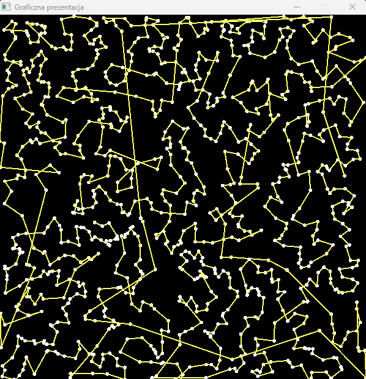

# SalesmanProblem
App solving travelling salesman problem using nearest neighbor algorithm. App developed in 2020.

## Technologies Used
- C language
- Allegro 5.0.10 library - used for graphic representation 

## Example
### App

### Graphic representation

## Installation

Allegro 5 library needs to be installed before starting the application. It can be downloaded from [authors site.](https://liballeg.org/)
